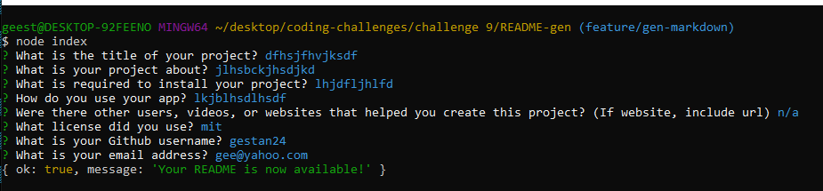

# README Generator

## Intent

Allows user's to generate README files with their own input, without the hassle of making an actual layout.

## Installation

You'll only need a few things for this app. That would be npm and inquirer.

## Built With

* JS

* NodeJS

# App Example

## Demonstration Link

